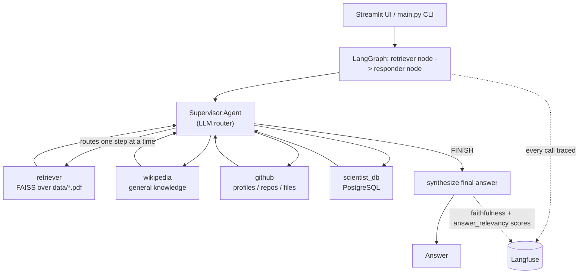

# Agentic RAG Supervisor

An agentic RAG system built on LangChain and LangGraph. Instead of a single agent guessing
which tool to reach for, a **supervisor agent** inspects each question and routes it to the
right specialized worker — a FAISS-backed document retriever, Wikipedia, the GitHub API, or a
PostgreSQL dataset — then synthesizes a final answer. Every run is fully traced in
**Langfuse**, and a golden-dataset evaluation harness scores answers on
accuracy, retrieval relevance, correctness, and faithfulness using LLM-as-judge metrics.

## How it works



Each worker is a single-tool [ReAct agent](https://langchain-ai.github.io/langgraph/); the
supervisor only sees each tool's **name and description** and decides where to route next -
tool behavior isn't hardcoded into the routing logic, so adding a new tool (see `scientist_db`)
is enough to make the supervisor start using it.

## Features

- **Supervisor-routed multi-tool agent** (`src/node/supervisor_agent.py`) — an LLM router picks
  the right tool per step instead of one flat ReAct loop guessing; capped at 4 routing steps.
- **Four tools**: a FAISS document retriever over `data/*.pdf`, Wikipedia, the GitHub REST API,
  and a PostgreSQL lookup over a small dataset of CS/AI pioneers.
- **Full observability via Langfuse** — every graph run, tool call, and LLM call is traced
  end-to-end; cost and token usage match your OpenAI usage dashboard exactly.
- **Two layers of automatic scoring**:
  - *Live queries* (Streamlit / CLI) get `faithfulness` and `answer_relevancy` attached to
    their trace automatically - both reference-free, no golden answer required.
  - *Golden-dataset evaluation runs* additionally get `accuracy_f1`, `retrieval_hit`,
    `retrieval_precision_at_k`, `retrieval_recall`, and `correctness` - since those require a
    known-correct answer to compare against.
- **Golden-dataset evaluation harness** (`evaluation/`) - 23 hand-written Q&A pairs grounded in
  `data/attention.pdf` and a resume PDF, with deterministic + LLM-judge metrics.
- **Langfuse Dataset/Experiment integration** - upload the golden dataset to Langfuse and run
  experiments comparing runs side by side in the UI.
- **Streamlit UI** for interactive search over the loaded documents.

## Project structure

```
main.py                        CLI entry point (AgenticRAG)
streamlit_app.py                Streamlit UI

src/
  config/config.py              Env var loading (OpenAI, GitHub, Langfuse, Postgres)
  document_ingestion/            PDF loading + chunking
  vectorstore/                   FAISS vector store
  graph_builder/                 LangGraph wiring: retriever node -> responder node
  node/
    reactnode.py                 Tool definitions (retriever, wikipedia, github, scientist_db)
    supervisor_agent.py          Supervisor + per-tool worker agents
  observability/
    langfuse_client.py           Langfuse CallbackHandler setup
    judges.py                    Shared LLM-judge prompts/models (correctness, faithfulness,
                                  answer_relevancy)
    live_scoring.py              Attaches faithfulness/answer_relevancy to every live trace
  state/rag_state.py             LangGraph state schema

evaluation/
  golden_dataset.json            23 golden Q&A pairs
  metrics.py                     token-F1, retrieval relevance, judge re-exports
  evaluate.py                    Runs the golden dataset, writes a JSON report + Langfuse scores
  langfuse_dataset.py            Uploads the golden dataset into a Langfuse Dataset
  langfuse_eval.py               Runs the golden dataset as a Langfuse Dataset Experiment

data/
  *.pdf                          Source documents indexed by the retriever
  sql/seed_scientists.sql        Seed data for the scientist_db tool
```

## Setup

**Requirements:** Python 3.13+, [uv](https://docs.astral.sh/uv/), a local PostgreSQL server
(optional - only needed for the `scientist_db` tool).

```bash
uv sync
```

### Environment variables

Copy `.env.example` to `.env` and fill in your own values:

```bash
cp .env.example .env
```

| Variable | Required | Purpose |
|---|---|---|
| `OPENAI_API_KEY` | yes | LLM calls (`gpt-4o`) and embeddings |
| `GITHUB_TOKEN` | no | Raises the GitHub API rate limit for the `github` tool |
| `LANGFUSE_PUBLIC_KEY` / `LANGFUSE_SECRET_KEY` / `LANGFUSE_HOST` | no | Tracing/scoring - skipped entirely if unset |
| `DATABASE_URL` | no | Postgres connection for `scientist_db` - tool reports "unreachable" if unset/down |

### Postgres (optional, for `scientist_db`)

```bash
createdb ragdemo
psql -d ragdemo -f data/sql/seed_scientists.sql
```

This creates a `scientists` table (`id, name, field, known_for, birth_year`) seeded with 15
computer science / AI pioneers.

## Running

```bash
# CLI - runs a few example questions, then optional interactive mode
uv run python main.py

# Streamlit UI
uv run streamlit run streamlit_app.py
```

Drop your own PDFs into `data/` before starting - they're indexed automatically on startup.

## Evaluation

```bash
# Full run against the golden dataset (23 questions, deterministic + LLM-judge metrics)
uv run python evaluation/evaluate.py

# Fast/free smoke test
uv run python evaluation/evaluate.py --limit 5 --no-llm-judge

# Upload the golden dataset into Langfuse, then run it as a Langfuse Experiment
uv run python evaluation/langfuse_dataset.py
uv run python evaluation/langfuse_eval.py --run-name "baseline"
```

`evaluate.py` writes a JSON report to `evaluation/results/` and, if Langfuse is configured,
attaches all 6 metrics directly to each question's trace.

## Observability

If `LANGFUSE_PUBLIC_KEY`/`LANGFUSE_SECRET_KEY` are set, every graph run is traced automatically
via a LangChain `CallbackHandler` threaded through `config` on every node - no manual
instrumentation needed elsewhere. Traces from `evaluation/evaluate.py` are tagged `evaluation`
so they're distinguishable from real usage in the Langfuse UI.
